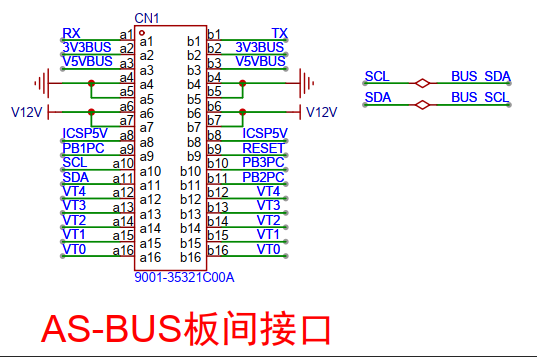
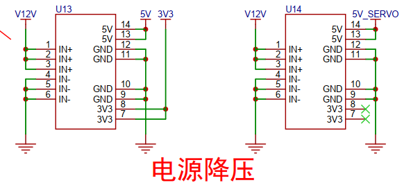
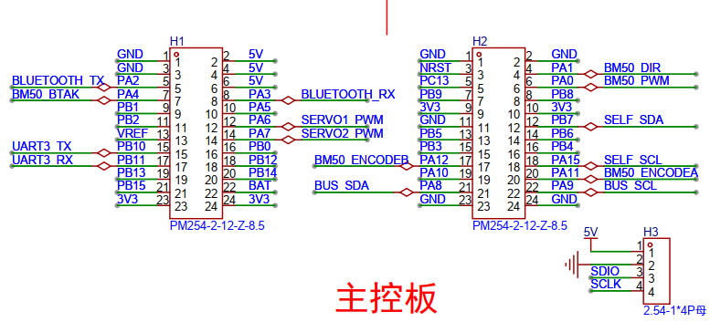
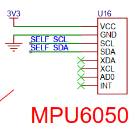
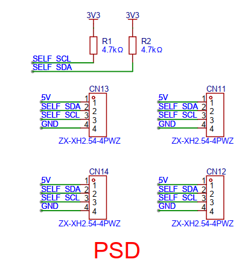
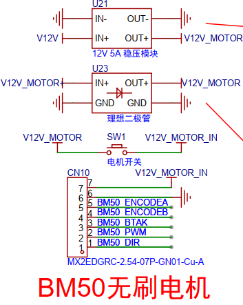
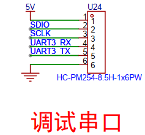
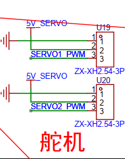
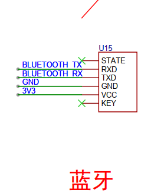

# 一、设计需求

主控板需实现以下核心功能：
1.  **姿态感知与计算：**
    *   通过 **4个** 太阳敏感器接口读取入射光角度数据。
    *   结合 IMU 提供的卫星本体坐标系姿态角数据。
    *   计算太阳光方向与卫星本体坐标系的夹角。
2.  **姿态控制：**
    *   对计算得到的夹角进行 PID 运算。
    *   驱动 **无刷电机** 控制 **反作用飞轮**，调整卫星姿态，使其朝向太阳光。
    *   驱动舵机控制太阳帆板翻转。
3.  **辅助功能：**
    *   支持 **蓝牙无线通信**。

**关键设计要点：**
*   **无刷电机：** 选用 **力矩大、体积小** 的 BM50 型号，并为其供电设计 **保护电路**。
*   **电源：** 需考虑不同负载（舵机、主控、传感器）的供电需求与隔离。
*   **接口：** 预留标准化的板间连接接口 (AS-BUS)。

# 二、设计思路

## 1. AS-BUS 板间接口
*   **功能：** 提供标准化的电源与信号连接通道，用于连接系统内各功能板卡。
*   **示意图：** 

## 2. 电源降压电路
*   **功能：** 将 AS-BUS 接口输入的电源电压降压为系统所需的 5V。
*   **设计：**
    *   采用 **两路独立的 5V 降压模块**。
    *   **一路 5V：** 专供 **两个舵机** 使用，避免舵机动作对主控电源造成干扰。
    *   **另一路 5V：** 供给主控板上的 **STM32G431CBT6 核心板、IMU、太阳敏感器接口、蓝牙模块** 等需要 5V 供电的组件。
*   **示意图：** 

## 3. STM32G431CBT6 核心板
*   **功能：** 主控制器，负责：
    *   采集传感器数据 (IMU姿态角、太阳敏感器角度)。
    *   执行姿态解算与 PID 控制算法。
    *   驱动无刷电机和舵机执行机构。
    *   管理蓝牙通信。
*   **示意图：** 

## 4. MPU6050 (IMU)
*   **功能：** 实时测量并反馈 **卫星本体坐标系** 的姿态角 (通常为三轴加速度和角速度，需经软件融合计算姿态)。
*   **示意图：** 

## 5. 太阳敏感器接口 (x4)
*   **功能：** 连接 **4个** 太阳敏感器 (PSD)，接收其检测到的入射光角度信息 (通过 I2C 等接口)。
*   **示意图：** 

## 6. BM50 无刷电机驱动电路
*   **功能：** 驱动 **BM50 无刷电机**。
*   **作用：** 电机轴承连接 **反作用飞轮**，通过改变电机转速产生控制力矩，实现基于陀螺仪 (IMU) 和太阳敏感器数据的 **卫星姿态动量控制**。
*   **关键：** 包含针对该 **大扭矩、小体积** 电机的 **供电保护措施** (如过流保护)。
*   **示意图：** 

## 7. 调试串口
*   **功能：** 用于：
    *   程序下载与烧录。
    *   在线仿真调试。
    *   串口通信 (调试信息输出/指令输入)。
*   **示意图：** 

## 8. 舵机接口
*   **功能：** 连接并驱动舵机，用于控制 **太阳帆板** 的翻转动作。
*   **示意图：** 

## 9. 蓝牙模块
*   **功能：** 提供 **无线通信** 能力，用于与外部设备进行无线数据交互。
*   **示意图：** 