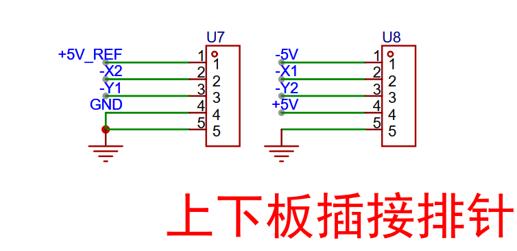
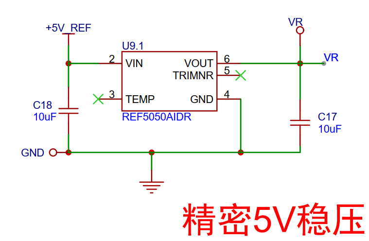
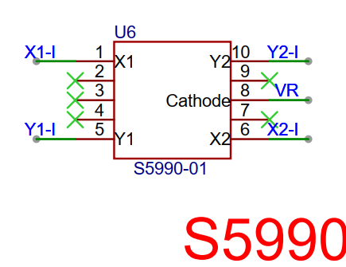
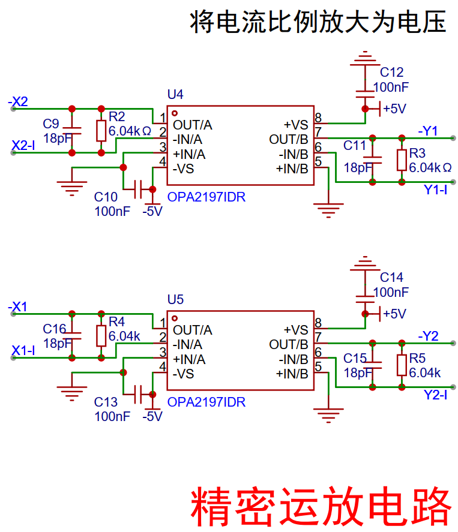
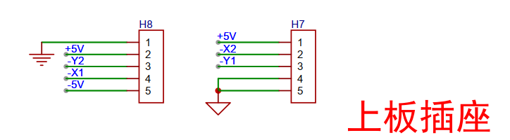
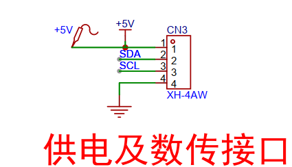
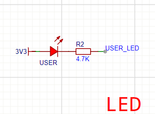
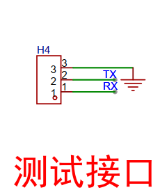
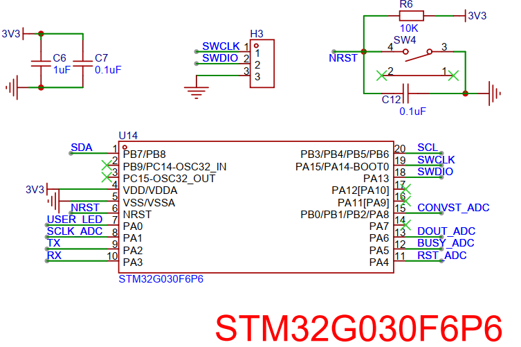
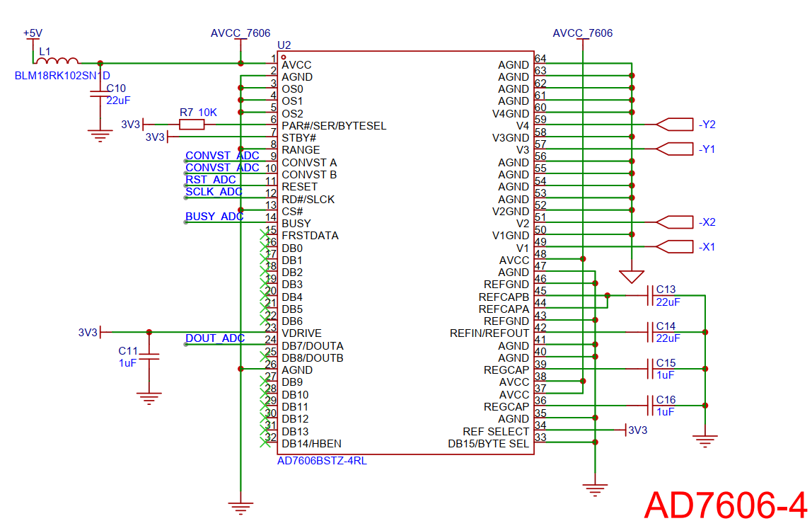

# 一、设计需求

基于二维光电位置敏感探测器(Position Sensitive Detector, PSD) **S5990**，设计一款太阳敏感器。

S5990 在敏感区域（4x4mm）受到光照时，会产生感应电流并通过其四个引脚输出。通过采集这四个引脚的电流值，并依据器件手册提供的公式，可计算出光斑在敏感面上的坐标位置（X, Y）。

在 S5990 上方加装带有中心透光孔的遮光罩，将入射光约束为单束光线。结合计算得到的光斑坐标以及遮光罩与 S5990 敏感面的距离，即可进一步计算出入射光角度。

为减小太阳敏感器的整体尺寸，设计采用上下板结构，通过排针与排母进行插接。这种分层设计还有以下关键优势：
1. **空间优化：** 减小设备长宽尺寸。

2. **安装便利：** 将S5990安装在上板**背面**（朝向遮光罩方向），而将信号调理电路（精密运放等）布置在上板**正面**。

3. **测量便捷：** 正面电路布局便于调试和测量，同时背面安装确保S5990光敏面正对遮光罩透光孔。

   

## 上板功能
将 S5990 输出的电流信号转换为电压信号，供下板采集。

## 下板功能
1.  采集来自上板的电压信号。
2.  计算光斑在 S5990 敏感面上的坐标及入射光角度。
3.  通过 I2C 接口将计算结果传输至主控板。

# 二、设计思路

## 上板电路

### 1. 上下板插接排针
*   **作用：** 连接下板，减小设备长宽尺寸。
*   **示意图：** 

### 2. 精密 5V 稳压电路
*   **作用：** 为 S5990 提供稳定的 5V 基准电压。
*   **示意图：** 

### 3. S5990 (核心元件) - **背面安装**
*   **安装位置：** 布置于上板**背面**，确保光敏面正对遮光罩透光孔。

*   **作用：** 二维光电位置敏感探测器。光照（光斑）作用于其 4x4mm 敏感区域时，产生与光强成比例的四通道输出电流。
*   **输出特性：** 在 5V 基准电压下，各引脚输出电流范围为 -500 ~ 500 μA。
*   **示意图：** 

### 4. 精密运放电路 (电流转电压) - **正面安装**
*   **安装位置：** 布置于上板**正面**，便于调试和测量。

*   **作用：** 将 S5990 的输出电流信号转换为电压信号。
*   **转换关系：** 放大倍数为 6k (U = 6000 * I)，输出电压范围为 -3 ~ 3V。
*   **示意图：** 

## 下板电路

### 1. 上下板插接排母
*   **作用：** 连接上板，减小设备长宽尺寸。
*   **示意图：** 

### 2. 供电及通信接口
*   **作用：** 提供设备电源输入（5V）以及与主控板通信的 I2C 接口。此为设备与外部连接的唯一接口（4引脚）。
*   **示意图：** 

### 3. 用户 LED
*   **作用：** 指示设备工作状态。
*   **示意图：** 

### 4. 电压转换电路 (反相与降压)
*   **作用：**
    *   将外部输入的 5V 电源转换为 -5V，为运算放大器提供负电源。
    *   将 5V 电源降压至 3.3V，为 STM32G030 微控制器供电。
*   **示意图：** 

### 5. 测试接口 (UART)
*   **作用：** 提供串行通信接口，便于调试与测试。
*   **示意图：** 

### 6. STM32G030 最小系统
*   **作用：** 核心控制单元。
*   **主要功能：**
    *   通过 SPI 接口驱动 AD7606 模数转换器(ADC)，采集上板输出的电压信号。
    *   处理 ADC 数据，计算光斑坐标及入射光角度。
    *   提供 UART 接口用于测试调试。
    *   提供 SWD 接口用于程序烧录与调试。
    *   通过 I2C 接口与主控板通信。
*   **示意图：** 

### 7. AD7606-4 (模数转换器)
*   **作用：** 采集上板输出的四路模拟电压信号，并通过 SPI 接口将数字转换结果传输至 STM32G030。
*   **示意图：** 